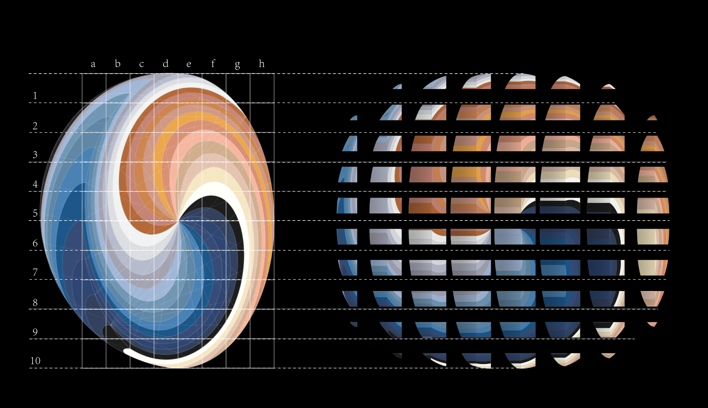

# Architecture - sandbox

## About

This is a creative project. We want to generate brick walls with different profiles from a single picture.

## The original image

## Result

For the scripts and result, please refer to [profile_brick.ipynb](./profile_brick.ipynb).

## Misc

Please note that the `.py` files exported from the notebook are not guaranteed to work.
